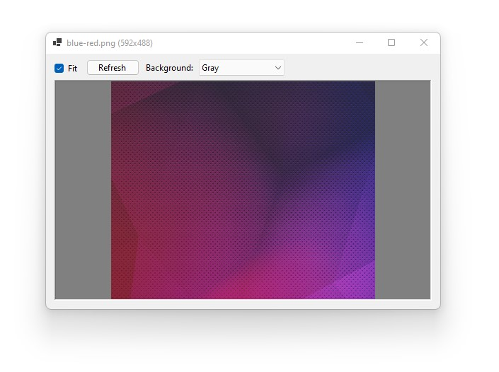

# Live Picture Viewer

**Live Picture Viewer displays an image file and updates when the file changes on disk.** This tool makes it easy to continuously monitor the output of graphics code as it is being written without requiring the user to leave the development environment.

